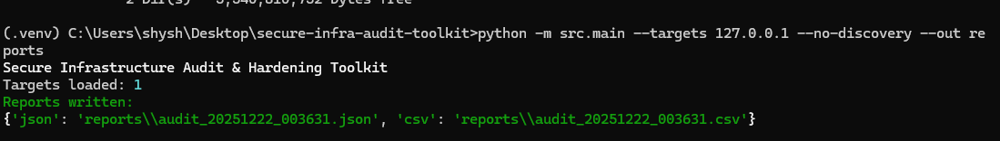

## Project Overview
This project demonstrates practical cybersecurity technician skills used in enterprise and industrial environments.
It focuses on identifying exposed network services, validating configurations against an approved baseline,
and producing audit-ready reports to support remediation and attack surface reduction.

Designed with real-world IT and plant environments in mind (e.g., manufacturing, labs, and enterprise networks),
The toolkit emphasizes safe discovery, port visibility, and operational security best practices.

## What This Shows Employers
- Understanding of network and server attack surfaces
- Port configuration and baseline validation
- Identification of legacy and insecure protocols
- Secure, authorized auditing practices
- Clear documentation and reporting for remediation
- Python scripting applied to cybersecurity operations

---
**Author:** Shanice Adams  
**Role Focus:** Cybersecurity Technician / Infrastructure Security  
**Experience Context:** Enterprise IT, industrial environments, server and network builds

## Example Output

The following screenshots show sample output generated during an authorized local audit.

### Terminal Execution

### CSV Audit Report

### JSON Audit Report

Why This Matters

In enterprise and industrial environments, cybersecurity is not just about identifying vulnerabilities—it is about understanding how infrastructure is configured, what services are exposed, and whether those exposures align with business and operational requirements.

This project demonstrates a practical, infrastructure-first approach to cybersecurity. Rather than relying on intrusive testing or theoretical controls, it focuses on visibility, baseline validation, and clear documentation. The output is designed to support real-world decision-making by operations, security, and IT teams.

Specifically, this project shows the ability to:

⦁	Validate port and service exposure against an approved security baseline

⦁	Identify legacy or high-risk services that increase the attack surface

⦁	Produce audit-ready documentation suitable for regulated environments

⦁	Support remediation and configuration hardening without disrupting operations

⦁	Bridge cybersecurity principles with hands-on infrastructure experience

In environments such as manufacturing, utilities, and other regulated industries, this approach helps organizations reduce risk while maintaining system reliability, uptime, and compliance.

How This Would Be Used in Production

In a production environment, this toolkit would be used as a controlled, authorized assessment tool to support ongoing infrastructure security and configuration management.

Typical usage scenarios include:

Baseline validation: Verifying that servers, workstations, or network-connected devices comply with approved port and service configurations before or after deployment

Change verification: Confirming that system changes, upgrades, or maintenance activities did not introduce unexpected service exposure

Periodic audits: Supporting scheduled security reviews and compliance checks in regulated environments

Incident response support: Quickly identifying exposed services during the investigation of suspected misconfigurations or security events

The tool is designed to run safely in live environments, with a focus on visibility and documentation rather than exploitation. Results are produced in structured CSV and JSON formats, enabling easy review by security, IT, and operations teams, as well as integration into existing audit and remediation workflows.

By aligning technical findings with baseline policies and remediation guidance, the toolkit supports informed decision-making while maintaining system reliability, uptime, and operational continuity.

## Authorization Notice
This tool is intended for authorized internal auditing and educational use only.
All scanning must be approved by the system/network owner.
